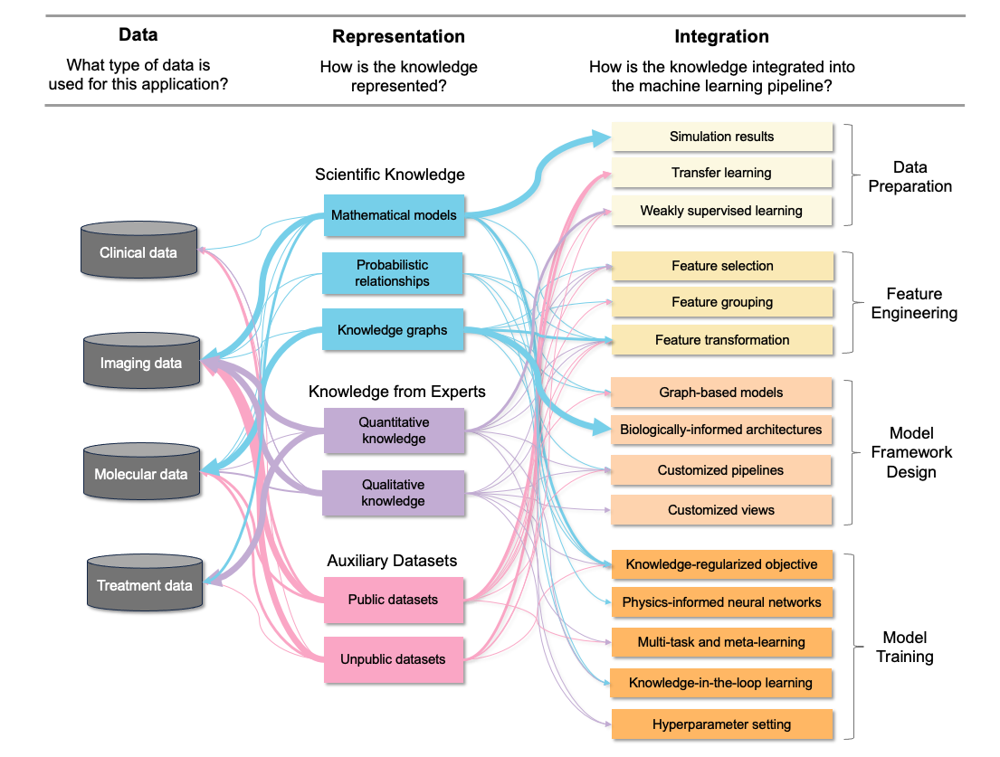

---
# Feel free to add content and custom Front Matter to this file.
# To modify the layout, see https://jekyllrb.com/docs/themes/#overriding-theme-defaults

title: Overview 
layout: default
order: 1
---

## Knowledge-Informed Machine Learning for Cancer Applications

### Machine Learning for Cancer 

Cancer remains one of the most challenging diseases to treat in the medical field, with its incidence escalating alongside the increasing global life expectancy. Machine learning has enabled in-depth analysis of rich multi-omics profiles and medical imaging for cancer diagnosis and prognosis. Still, cancer applications present several modeling challenges for machine learning models, including the limited labeled sample sizes, the intricate interplay of high-dimensionality data types, the heterogeneity observed among patients and within tumors, and concerns about model interpretability. 

One strategy to tackle these challenges is to integrate biomedical knowledge into machine learning models, referred to as **knowledge informed machine learning (KIML)**. By regularizing the learning process using domain knowledge, the accuracy, robustness, and interpretability of models can be improved. Over the past decase, knowledge-informed machine learning has garnered increasing interest and demonstrated success across scientific, engineering, and health applications, particularly as a solution for settings with limited training data. 

### A Review of KIML for Cancer 

Here, we focus on knowledge informed machine learning models applied in the cancer domain, where rich biomedical knowledge exists. We reviewed 127 studies focusing on machine learning and deep learning works published within the last 10 years (from 2012 onward). All works were categorized based on three dimensions:

* What type of data is used for this application?
* In what form is the knowledge represented?
* How is the knowledge integrated into the machine learning pipeline? 

An overview of the surveyed papers by category is shown below:

*Figure 1. Taxonomy of knowledge-informed machine learning in cancer diagnosis and prognosis. Our literature review categorizes existing along three dimensions: type of data, form of knowledge representation, and strategy for knowledge integration. Note that one paper may be included in more than one category. The thickness of the paths indicates the relative frequency of papers in each area (thin: one to four papers; medium: five to nine papers; thick: equal or more than ten papers*

Below are studies compiled from our review. This website is meant as (1) a resource for those looking to use knowledge informed machine learning for their application (healthcare or non-health related) but unsure how each component is realized in practice, and (2) a snapshot of knowledge informed machine learning as an emerging field.

**Use this [link](https://forms.gle/5kpcCzYFpy5vYhGp8) to submit a paper to be added to this table.** We will update the table every month. 

 

<table id = "kiml" class="display">
  
      
        <thead>
        <tr>
          
            <th>{{ pair[0] }}</th>
          
        </tr>
        </thead>
      
    
        
      		
      			
      		  <a href = "{{ beatles[1] }}"> {{ beatles[0] }} </a> 
      		
      		   {{ pair[1] }}
      		
          
      
    
</table>

  

 
 

